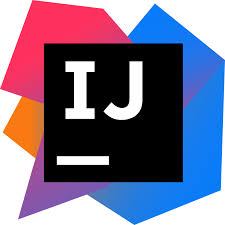

### Hallo und herzlich willkommen 👋

Mein Name ist Parssa.
Ich bin 23 Jahre alt und studiere für vorraussichtlich noch 2 Semestern Informatik an der HHU. 

Die Programmiersprache die ich am besten beherrsche ist: 

Meine IDE: 

Momentan arbeite ich an: 

  - 🍃 einer Vertiefung meiner Spring Boot und Thymeleaf Kenntnisse
  - 💻 einer Vertiefung meiner HTML und CSS Kenntnisse
  - 🎥 einem Youtube Channel auf dem es primär und die Themen Studium,Informatik und DIY Solutions geht, beispielsweise um den Ölwechsel selbst vorzunehmen um
    bares 💰 zu sparen, am Beispiel des altbewährten Klassikers Golf 4.
    Eine Verlinkung des Youtube-Channels erfolgt, sobald ich die ersten Videos hochgeladen habe 🙏
    
Ich bin gerade dabei Fuß in der IT-Branche zu fassen und versuche schon bei einem Unternehmen zu arbeiten, bei dem ich auch nach meinem Studium direkt anfangen kann 👋 👀
    
